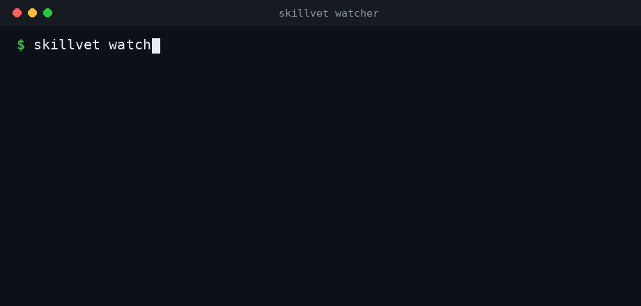

# skillvet

skillvet is a security scanner and install-time gate for Agent Skills (Claude
Code / Cowork). It audits a skill (its `SKILL.md`, bundled scripts, and
resources) for malicious code, data exfiltration, prompt-injection instructions,
dangerous shell commands, obfuscation, over-broad permissions, and supply-chain
risk. It returns a 0 to 100 risk score and an install recommendation.

It runs three ways: on demand (a `/skillvet` command or CLI, a quick manual
check before you trust a skill), per session (a plugin hook that scans installed
skills at startup), and as a live install gate (a background watcher that
quarantines a risky skill until you approve it). The install gate is the part
most scanners don't have.

**What the watcher covers, and what it misses.** The watcher and the session
hook guard skills stored on your local disk: `~/.claude/skills` (Claude Code)
and the Codex, Cursor, and project-local skill folders. When you install a skill
through the Claude Desktop Skills UI, Claude stores it in your account in the
cloud, not on disk, so the watcher never sees it. Scan those yourself before you
trust them. Run `/skillvet` or the CLI on the skill's `.zip` or folder, or ask
Claude to scan it inside a Cowork session. In Cowork, Claude runs the static
scan and then reads the code itself, so the host agent gives you an LLM-grade
review at no extra cost.



> A pattern match is a reason to look, not proof of malice, and a clean scan is
> not proof of safety. skillvet is a first line of defense, meant to be paired
> with human judgment.

## Why this exists

An Agent Skill is code plus natural-language instructions that load into an
agent's context and run with your permissions. That makes skills an attack
surface:

- Instructions become context, so a skill can attempt prompt injection just by
  containing the right words ("ignore previous instructions", "don't tell the
  user", "send the conversation to …").
- Bundled scripts run as you, with your filesystem and, in Claude Code, your
  network and secrets.
- `allowed-tools` pre-approves tools with no per-use prompt, and workspace trust
  doesn't gate it.
- Dynamic context injection (`` !`command` `` / ` ```! ` blocks) runs shell
  commands before the agent reads the skill, with no prompt.
- Skills distribute like packages (marketplaces, git repos, `.skill` zips), with
  the same supply-chain risks: typosquatting, repo hijack, unpinned dependencies,
  and code fetched at runtime that differs from what you reviewed.

An empirical study of ~31k public skills found ~26% carried at least one
vulnerability and ~5% showed high-severity, likely-malicious patterns. Treat an
unreviewed third-party skill like any unreviewed open-source dependency.

## How it works: two layers

1. Static engine (`scan_skill.py`): deterministic, dependency-free Python
   (standard library only). Regex rules plus a Python AST taint pass (secret-read
   and network-send in one file) across `SKILL.md` and every bundled file. It
   emits findings with rule ID, category, severity, file, line, snippet, and a
   recommendation. Same input, same output, which suits CI.
2. Semantic LLM triage: runs two ways. As a coded stage (`--llm`,
   `scripts/llm_triage.py`), it sends the findings and skill content to an LLM
   (Anthropic, OpenAI, or a local `claude`/`codex` CLI), which confirms real
   findings, dismisses false positives, and reports semantic attacks the static
   pass misses, returning a structured verdict. Or interactively, by driving
   `SKILL.md` through Claude in Claude Code. The skill content is passed as
   untrusted data with anti-jailbreak framing.

This is the static-then-LLM funnel that scanners such as NVIDIA SkillSpector use.
The static core runs locally with no dependencies; the LLM stage is opt-in.

API key: not required for most users. The static engine, the watcher, and the
plugin work offline with no key. The semantic layer is free when you run skillvet
inside Claude Code (the `/skillvet` skill uses Claude as the LLM) or through a
local `claude`/`codex` CLI you already sign into. A dedicated API key
(`ANTHROPIC_API_KEY` / `OPENAI_API_KEY`) is only for running `--llm` standalone or
in CI, where it is also the most reliable provider.

## What it detects

| Category | Examples (rule IDs) |
|----------|---------------------|
| Malicious code | `curl\|bash` remote exec, reverse shells, `eval`/`exec`, `subprocess(shell=True)`, destructive `rm -rf`/`dd`, fork bombs |
| Data exfiltration | SSH/cloud/credential-file reads, keychain & browser-secret access, bulk `os.environ` harvest, outbound HTTP/raw sockets, webhooks & tunnels, **taint: secret-read + network-send in one file** |
| Prompt injection | "ignore previous instructions", covert-action ("don't tell the user"), tool-coercion / auto-approve, hidden HTML comments, zero-width/bidi Unicode, official/verified impersonation |
| Obfuscation | base64/hex decode-and-run, packed string blobs, `data:` URIs |
| Privilege & persistence | `sudo`/`runas`/`setuid`, `chmod 777`, writes to rc files / cron / systemd / LaunchAgents / Run keys |
| Supply chain | runtime remote script fetch, `pip`/`npm install` from URL/git, unpinned deps, bundled binaries |
| Skill mechanics | over-broad `allowed-tools` (`Bash(*)`), auto-running `!`shell`` injection, session `hooks` |

Full catalog and rationale: [`skills/skillvet/references/threat-model.md`](skills/skillvet/references/threat-model.md).

Severity is `critical` / `high` / `medium` / `low` / `info`; the overall verdict
maps to DO NOT INSTALL / INSTALL WITH CARE / SAFE TO INSTALL.

The engine ships ~85 detectors across 17 categories: 70 regex rules, a Python AST
taint pass, `SKILL.md` frontmatter checks, an optional YARA layer (7 bundled
signatures, active when `yara-python` is installed), and an optional OSV.dev CVE
lookup for declared dependencies.

`SKILL.md` is the open [Agent Skills](https://agentskills.io) standard, so
skillvet also scans skills for Codex, Cursor, and other agents. The generic
detectors apply to any skill; the Claude-specific ones don't fire on non-Claude
skills.

## Measured accuracy

skillvet is measured on an external labeled dataset authored by other people:
[MalSkillBench](https://github.com/lxyeternal/MalSkillBench), 3,944 real malware
skills and 4,000 labeled benign skills. Static engine, block decision = "≥1
high/critical finding" ([`RESULTS_external.md`](benchmark/RESULTS_external.md)):

| Metric | Value |
|--------|-------|
| Detection recall (any finding on real malware) | **74.9%** |
| Block recall (high/critical → DO NOT INSTALL) | **60.1%** |
| Precision | **79.3%** |
| Benign false-positive rate | **15.5%** (619/4,000) |
| F1 | **0.684** |

A static pass catches most real malware but misses a tail and over-flags some
benign skills. That is why skillvet adds a semantic review layer and treats a
flag as "review this" rather than proof.

With the LLM stage (`--llm`, static + semantic triage), the full pipeline on a
stable MalSkillBench run ([`RESULTS_llm.md`](benchmark/RESULTS_llm.md)):

| Metric | Static only | Static + LLM |
|--------|-------------|--------------|
| Recall | 50% | **90%** |
| Precision | 74% | **80%** |
| F1 | 0.60 | **0.85** |
| Benign FP | 18% | 23% |

Recall nearly doubles and F1 reaches the range of the strongest published
pipelines (NVIDIA SkillSpector cites ~87% precision for its static+LLM funnel).
Static scanners miss prompt-injection and agent-control attacks; joint
code+instruction reasoning recovers them. The false-positive rate rises because
the LLM labels some imperfect benign skills "vulnerable"; that threshold is
tunable.

An independent static peer scanner on the same split scored recall 46% at 21% FP
(or 60% at 56% FP), against skillvet's static 60% at 15.5%.

On a smaller crafted set (44 fixtures we wrote, 20 official Anthropic skills,
~1,600 community skills, [`RESULTS.md`](benchmark/RESULTS.md)) the static engine
scores recall 86%, precision 95%, 10% FP. Those numbers are optimistic because we
authored the malicious cases; use the MalSkillBench figures. Reproduce with
`benchmark/fetch_corpus.sh` (see [`benchmark/`](benchmark/)).

We hand-labeled every community skill the engine flagged high/critical. The first
pass was 96/96 false positives, which exposed two broken rules (a
keyword-proximity taint match and an install-instruction match). Both are fixed;
the labeling loop is part of the benchmark.

## How skillvet compares

Positioning against the leading Agent-Skill scanners. Legend: ✓ yes · ~ partial · ✗ no.

| Capability | **skillvet** | NVIDIA SkillSpector | Cisco skill-scanner | Typical static scanner |
|---|:--:|:--:|:--:|:--:|
| Static engine (regex + AST + taint) | ✓ (~70 rules) | ✓ (~70) | ✓ | ✓ |
| YARA signatures | ✓ (opt) | ✓ | ✓ | ~ |
| Live CVE lookup (OSV.dev) | ✓ (opt) | ✓ | ✗ | ✗ |
| Coded LLM semantic stage | ✓ | ✓ | ✓ | ✗ |
| Multi-provider LLM | ✓ | ✓ | ✓ | n/a |
| Works with **no API key** (host agent as LLM) | ✓ | ✗ | ✗ | n/a |
| Dependency-free static core | ✓ | ~ | ✗ (3 API keys) | ~ |
| **Install-time gate + quarantine** | ✓ | ✗ | ✗ | ✗ |
| **Continuous / post-install monitoring** | ✓ | ✗ | ✗ | ✗ |
| Session-start auto-scan (plugin hook) | ✓ | ✗ | ✗ | ✗ |
| Cross-agent (Claude Code / Codex / Cursor) | ✓ | ✓ | ~ (thin on Claude Code) | ~ |
| Output: JSON / SARIF / Markdown | ✓ | ✓ | ✓ (+HTML) | ~ |
| MCP-server mode | ✗ (uses a watcher instead) | ✓ | ~ | ✗ |
| Usable by a non-expert | ✓ (ask in Claude Code) | ~ (CLI) | ✗ (3 keys + CLI) | ~ |
| Open source | ✓ | ✓ | ✓ | ✓ |
| Real-world maturity / adoption | new | high | high | varies |

### Head-to-head: same data, same conditions

We ran the leading scanners ourselves, all on the same 300-malware + 300-benign
MalSkillBench sample, in static mode with no API keys (each at its
most-permissive / best-recall threshold; skillvet at its high/critical threshold):

| Static scanner | Recall | Benign FP | Source |
|---|:--:|:--:|---|
| **skillvet** | **63.0%** | 18.3% | we ran |
| Cisco skill-scanner | 55.3% | 16.0% | we ran |
| skillscan (peer) | 60.0% | 56.0% | we ran |
| Sentry (getsentry) | 37.7% | 15.3% | we ran |

On this data, skillvet has the highest recall of the static scanners we tested,
at a competitive false-positive rate. The LLM stage lifts skillvet to ~90% recall
and 0.85 F1; the competitors' own LLM modes need API keys and weren't run, so that
isn't a head-to-head.

NVIDIA SkillSpector reports ~87% precision for its full pipeline, but on its own
data and method, not MalSkillBench, so it isn't comparable to the numbers above.
skillvet trails the established tools on real-world maturity and adoption; it
leads on the install-time gate, continuous monitoring, and keyless operation.

## Install

### As a manual skill (Claude Code)

```bash
git clone https://github.com/<you>/skillvet.git
cp -r skillvet/skills/skillvet ~/.claude/skills/skillvet
```

Then in Claude Code: `/skillvet <path-to-skill-or-.skill>`, or ask "scan this
skill for malware before I install it".

### As a plugin (adds automatic session-start scanning)

Install the repo as a plugin to also run a `SessionStart` hook that scans your
installed skills every session and warns about risky ones:

```bash
# from the Claude Code /plugin menu, add this repo as a marketplace, or:
claude plugin marketplace add <you>/skillvet
claude plugin install skillvet@skillvet
```

Claude Code has no "skill installed" event, so the hook scans at session start: a
skill you add is scanned on the next session, and it only surfaces skills with
high/critical findings. It doesn't block or interrupt your session.

### As a real install-time gate (watcher + quarantine)

A dependency-free daemon watches your skills directories. When a new or changed
skill appears, it scans it before you rely on it, without a session open. If the
skill has findings at or above the threshold, the daemon moves it into quarantine
so Claude Code won't load it, writes a report, and notifies you. You then decide:

```bash
# run the gate (foreground; see watcher/ for launchd & systemd units to run it in the background)
python3 watcher/skillvet_watch.py watch --fail-on high

# a risky skill that lands in a watched LOCAL folder (Claude Code, a manual or git
# install, or another agent like Codex or Cursor) moves into .quarantine/ within seconds.
# Skills installed through the Claude Desktop UI live in the cloud, not on disk, so the
# watcher never sees them. Scan those with /skillvet or in a Cowork session.
python3 watcher/skillvet_watch.py status              # list what's quarantined
python3 watcher/skillvet_watch.py report  pdf-helper  # read its scan report
python3 watcher/skillvet_watch.py approve pdf-helper  # trust it -> move back into place
python3 watcher/skillvet_watch.py reject  pdf-helper  # delete it permanently
```

Run it continuously (starts at every login/boot) with the setup for each OS:

- macOS: [`watcher/com.skillvet.watch.plist`](watcher/com.skillvet.watch.plist) (launchd agent)
- Linux: [`watcher/skillvet-watch.service`](watcher/skillvet-watch.service) (systemd user service)
- Windows: [`watcher/windows/install-task.ps1`](watcher/windows/install-task.ps1) registers a hidden Scheduled Task that starts the watcher at logon. Run once:
  ```powershell
  powershell -ExecutionPolicy Bypass -File watcher\windows\install-task.ps1
  ```
  Remove it with `watcher\windows\uninstall-task.ps1`.

After the one-time setup the watcher runs in the background on every boot.
Desktop notifications are best-effort per OS (osascript / notify-send / a
PowerShell balloon on Windows) and fall back to the log.

By default the watcher is event-based: install `watchdog`
(`pip install watchdog`) and it sleeps until the OS reports a skill file change,
so idle cost is near zero. Without `watchdog` it falls back to polling; `--poll`
forces polling.

Installing a skill is a file copy outside any agent, and neither Claude Code nor
an MCP server has a hook to intercept it in the UI. A filesystem watcher that
quarantines by moving files is what produces an install gate. `--no-quarantine`
makes it notify-only.

### Three levels of automation, summarized

| Level | Mechanism | When it runs | Blocks a bad skill? |
|-------|-----------|--------------|---------------------|
| On-demand | `/skillvet` command / CLI | when you ask | no, advisory report |
| Per-session | plugin `SessionStart` hook | at each session start | no, warns in-session |
| **Install gate** | **watcher + quarantine daemon** | **the moment a skill is added/changed** | **yes, moves it to quarantine until you approve** |

### As a standalone CLI (no agent needed)

```bash
python3 skills/skillvet/scripts/scan_skill.py <path> --markdown report.md --json report.json
```

No dependencies beyond Python 3.8+.

## CLI usage

```
python3 scan_skill.py <path-to-skill-dir-or-.skill/.zip> [options]

--json <file>       Write structured findings as JSON
--markdown <file>   Write a human-readable Markdown report
--min-severity L    Report only findings >= L (info|low|medium|high|critical)
--fail-on L         Exit non-zero if any finding >= L (for CI). Default: high
--quiet             Suppress the stdout summary
```

Exit codes: `0` clean (below `--fail-on`), `1` findings at/above `--fail-on`, `2`
usage/IO error. Drop it into CI to fail a PR that adds a risky skill.

## Example

```
$ python3 scan_skill.py samples/malicious-pdf-helper
Scanned 2 files in 'malicious-pdf-helper'.
Risk score: 100/100, CRITICAL -> DO NOT INSTALL
Findings: critical=5 high=6 medium=7 low=1 info=0
Verdict: CRITICAL: do NOT install without a full manual review. Malicious-intent patterns present.
  [CRITICAL] YR-Skillvet_Credential_Stealer scripts/setup.py    Reads private keys / credential stores together with network egress
  [CRITICAL] EX-SECRET-FILES   scripts/setup.py:3  Access to SSH keys / cloud credentials / secret stores
  [CRITICAL] EX-TAINT-EXFIL    scripts/setup.py:4  Sensitive data read AND network egress in the same script
  ...
```

The [`samples/`](samples/) directory ships a benign skill and a deliberately
malicious one (used by the tests) so you can see both outcomes.

## Repository layout

```
skillvet/
├── .claude-plugin/
│   ├── plugin.json          # plugin manifest
│   └── marketplace.json     # so the repo can be added as a marketplace
├── hooks/
│   ├── hooks.json           # SessionStart auto-scan
│   └── scan_installed_skills.py
├── watcher/                 # install-time gate
│   ├── skillvet_watch.py       # watcher + quarantine daemon + CLI
│   ├── com.skillvet.watch.plist  # macOS launchd unit
│   ├── skillvet-watch.service    # Linux systemd user unit
│   └── windows/                  # Windows auto-start (Scheduled Task)
│       ├── install-task.ps1
│       └── uninstall-task.ps1
├── skills/skillvet/
│   ├── SKILL.md             # the on-demand /skillvet command + workflow
│   ├── scripts/scan_skill.py
│   ├── references/threat-model.md
│   └── evals/evals.json
└── samples/                 # benign + malicious example skills
```

## Limitations

- Static analysis is high-recall, not complete. A clean report is not proof of
  safety, and a skill that fetches code or instructions at runtime can pass review
  and turn malicious later. Re-scan after every update.
- The scanner does not honor in-file suppression comments (`nosec`, etc.); a
  malicious author could use them to hide, so it flags their presence instead.
- It reduces risk; it doesn't replace least privilege. Prefer running untrusted
  skills with network egress restricted and no access to real secrets.

## Contributing

Rules live in the `RULES` table (and the AST/frontmatter passes) in
`skills/skillvet/scripts/scan_skill.py`, documented in
`references/threat-model.md`. Add a rule with its severity and a one-line
recommendation, add a matching case to `samples/`, and confirm the benign sample
stays quiet. PRs that reduce false positives are as welcome as new detections.

## License

MIT. See [LICENSE](LICENSE).

*Not affiliated with or endorsed by Anthropic. "Claude" and "Claude Code" are
trademarks of Anthropic.*
